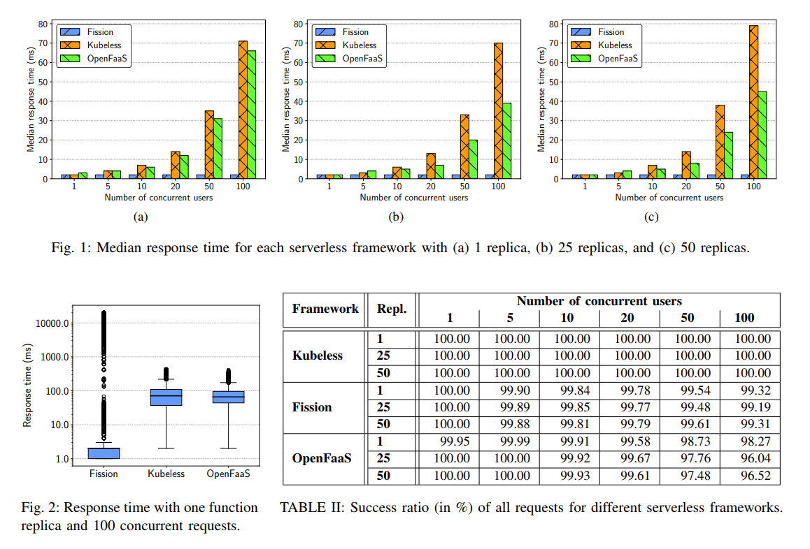
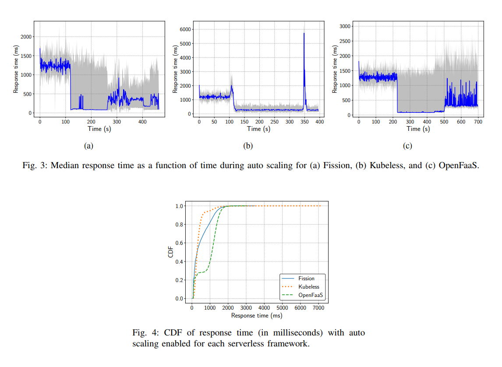

# **[An evaluation of open source serverless computing frameworks](https://users.aalto.fi/~premsag1/docs/mohanty2018serverless.pdf)**

## Abstract
Recent advancements in virtualization and software architecture have led to the new paradigm of serverless computing, which allows developers to deploy applications as stateless functions without worrying about the underlying infrastructure. Accordingly, a serverless platform handles the lifecycle, execution and scaling of the actual functions; these need to run only when invoked or triggered by an event. Thus, the major benefits of serverless computing are low operational concerns and efficient resource management and utilization. Serverless computing is currently offered by several public cloud service providers. However, there are certain limitations on the public cloud platforms, such as vendor lock-in and restrictions on the computation of the functions. Open source serverless frameworks are a promising solution to avoid these limitations and bring the power of serverless computing to on-premise deployments. However, these frameworks have not been evaluated before. Thus, we carry out a comprehensive feature comparison of popular open source serverless computing frameworks. We then evaluate the performance of selected frameworks: Fission, Kubeless and OpenFaaS. Specifically, we characterize the response time and ratio of successfully received responses under different loads and provide insights into the design choices of each framework.

**Categoria: performance evaluation, benchmarking, serverless computing, functions-as-a-service, open source framework.**

## Problema e Solução
Utilizar plataformas públicas de computação em núvem para aplicações serverless possui limitações. Uma alternativa para contornar essas limitações seria utilizar plataformas de código aberto. Contudo, essas plataformas até então não tiveram seu desempenho avaliado. Sendo assim, esse artigo provê uma comparação de desempenho de plataformas serverless de código aberto, avaliando sob diferente cargas de trabalho o tempo de resposta e a taxa de respostas com sucesso.   

## Avaliação e Resultados
Os experimentos executados compararam três plataformas de computação serverless de código aberto: Fission, Kubeless e OpenFaaS. Essa comparação é feita avaliando o impacto da carga de trabalho e do auto scaling dessas plataformas. 

**Experimento 1**:
- **Visão geral**: 5 Execuções com envio de 100.000 requisições sob diferente número de usuários concorrentes com auto scaling desligado.
- **Função**: Uma função de eco, que apenas retorna o valor de entrada. A string utilizada no experimento não foi mencionada.  
- **Métrica**: Tempo de resposta, taxa de sucesso.
- **Fator**: Número de usuários concorrentes - 1, 5, 10, 20, 50, 100. Número de réplicas da função - 1, 25, 50 (em 3 workers distintos que compôem o cluster kubernetes, em que cada um possuia 2vCPUs, 7.5GB RAM e executa o ContainerOptimized OS).
- **Resultados**: Fission possui a menor mediana de tempo de resposta (2ms) em todos os casos. Kubeless e OpenFaaS mantém a mediana de tempo de resposta abaixo de 80ms. É observado que não há mudança significativa a medida que o número de réplicas é alterado. Exceto para o Kubeless, que com 50 réplicas e 100 usuários concorrentes obteve tempo de resposta menor em 10ms. O Fission possui significativamente  mais outliers que as demais plataformas (1.336 ao total) e esses outliers também possuem maior valor de tempo de serviço, variando entre 1 e 20 segundos. Por fim, a taxa de sucesso para todos os casos foi de 100% para o Kubeless e de 99% para o Fission. O OpenFaaS obteve taxa de sucesso acima de 98% ou menor quando tinha-se 50 ou mais requisições concorrentes. 
- **Crítica**: Não explicou a razão pela qual o Fission obteve tempo de resposta tão pequeno, algo esperado visto o valor observado. Não garantiu (ou pelo menos não certificou) que as configurações utilizadas nos frameworks eram de fato justas pois o autor optou por utilizar configuração padrão ao máximo e não há garantia de que essas plataformas são utilizadas assim na prática.
- **Graficos e Tabelas**: 

**Experimento 2**:
- **Visão geral**: 5 Execuções com envio de 10.000 requisições explorando o impacto do auto scaling a 50% do uso de CPU.
- **Função**: Uma função implementada em Go que multiplica implementada em Go uma matriz 1000 por 1000.  
- **Métrica**: Tempo de resposta, taxa de sucesso.
- **Fator**: Número de usuários concorrentes - 1, 10.
- **Resultados**: Kubeless e OpenFaaS possuem taxa de sucesso de 100%, enquanto Fission possui 98.11%. A mediana do tempo de resposta do OpenFaaS é a maior dentre as plataformas, apesar de as demais possuirem outliers piores. Fission e Kubeless escalam réplicas após 100 segundos de experimento, sendo o Kubeless quem mantém a baixa latência por mais tempo. O OpenFaaS escala réplicas apenas após 200 segundos de experimento e possui maior tempo de execução de experimento devido os tempo de resposta serem maiores.  
- **Crítica**: Os gráficos da figura 3 estão em escalas diferentes, o que dificulta a comparação dos resultados. Além disso, não há marcação para melhor visualizar o evento observado. Além disso, mantém-se o mesmo problema de configuração padrão do experimento 1.f
- **Graficos e Tabelas**: 

## Conclusão 
Os experimentos executados evidenciam que o Kubeless possui desempenho mais consistente dentre as 3 plataformas, sendo seu desempenho justificado por sua arquitetura simples. Também conclui-se que para funções simples, Fission e OpenFaaS mantiveram baixa média e mediana de latência, mas que para funções de uso mais intenso da CPU esses frameworks em si devem ser escalados a fim de evitar gargalos individuais de seus componentes.  

## Críticas
O artigo adicionou uma tabela para comparar os recursos das plataformas Fission, Kubeless, OpenWhisk e OpenFaaS. Não havia necessidade pois o foco do trabalho era a avaliação de desempenho e adicionar essa tabela ocupa uma quantidade considerável de espaço. Além disso, nessa tabela há o OpenWhisk, uma plataforma que foi descrita no artigo mas não utilizada nos experimentos. Uma vez que esta plataforma não foi avaliada sua performance em comparação às demais, poderia ter sido removida da tabela e retirado o trecho que a descreve no artigo. Isso pouparia espaço que poderia ser utilizado para detalhar melhor as partes interessante deste artigo. Por fim, o artigo poderia explicar melhor a causa dos problemas de desempenho de cada plataforma e propor sugestões para a melhoria dos mesmos.    

## Relacionados
1. [Serverless computing: Current trends and open problems] sumariza características gerais de plataformas serverless e descreve problemas em aberto nessa área.  
2. [A preliminary review of enterprise serverless cloud computing (functionas-a-service) platforms] apresenta uma análise de recursos de sete plataformas serverless corporativas.
3. [Evaluation of production serverless computing environments] analisa a performance de plataformas públicas utilizando funções que consomem CPU, memória e disco.
4. [Serverless computing: An investigation of factors influencing microservice performance] avalia a performance de funções implantadas na AWS Lambda e Microsoft Azure Functions. 
5. [A provider-friendly serverless framework for latency-critical applications] avalia latência no OpenWhisk em diferentes níveis throughput (taxa de transferência) e concorrência. O autor identifica como melhorar a inicialização das funções substituindo contêineres por um novo mecanismo de isolação. 

## Links
- [IEEEXplore document](https://ieeexplore.ieee.org/document/8591002)
- [ResearchGate publication](https://www.researchgate.net/publication/328102827_An_Evaluation_of_Open_Source_Serverless_Computing_Frameworks)
- [Department of Computer Science, Aalto University (pdf)](https://users.aalto.fi/~premsag1/docs/mohanty2018serverless.pdf)
